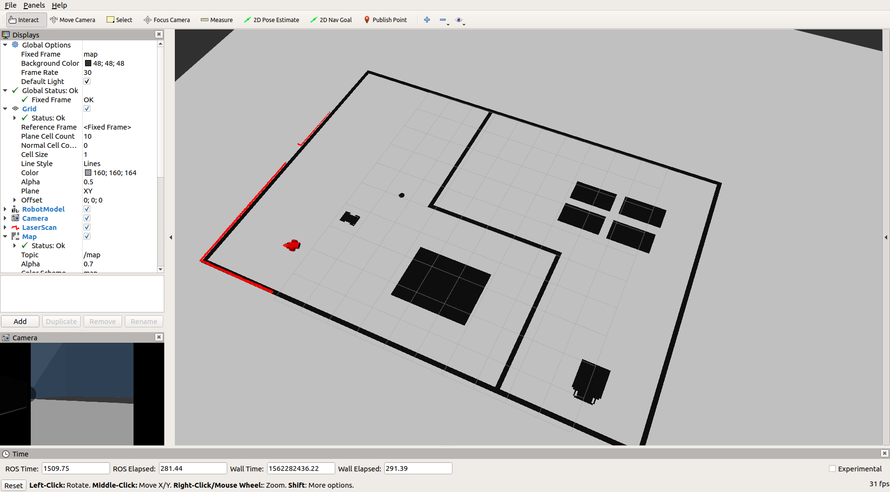
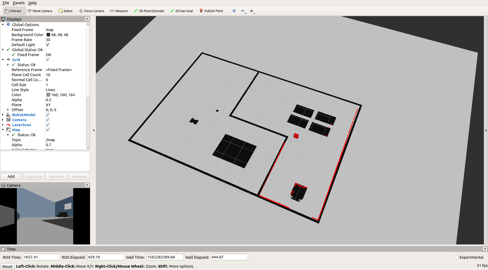
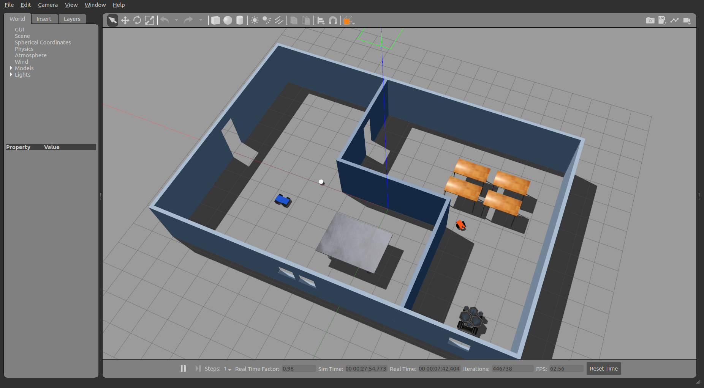

# Robotic Software Engineering Nanodegree-Project3 (Where am I?)

In this project, we localized a robot in a simulated environment using the AMCL (Adaptive Monte Carlo Localization) package in ROS.

### Localized Robot in RVIZ and Gazebo

#### Position 1

#### Position 2

